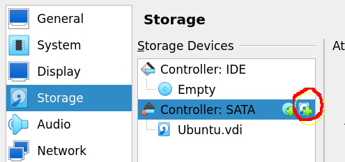
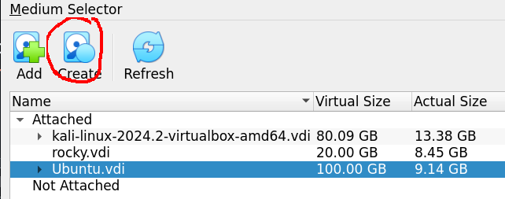

# Setting Up Disk Partitions in Linux

## Objective
This document outlines the process of adding, formatting, and mounting a new virtual disk in Linux systems.

---

## Steps

### 1. Adding a Virtual Disk

1. Verify that the virtual machine has been run at least once and is in a powered-off state before proceeding.
   - **Note**: Attempting this process while the VM is running may result in errors or unexpected behavior.

   

2. Access the `Settings` menu of the virtual machine.
3. Navigate to `Storage` and select the small icon under the chosen controller to add a new virtual disk.

   

4. Highlight the virtual machine and click `Create`. Select `Expert Mode` if `Guided Mode` is active.

   

5. Define a virtual disk size of **64GB** to simulate adding a new hard drive.

   

6. Finalize by clicking `Finish`, attach the newly created disk, and confirm it is successfully added to the virtual machine.

   

---

### 2. Formatting and Partitioning the Disk

1. Start the virtual machine and open a terminal.

   ```bash
   sudo parted
   ```

2. Identify the current hard drive in use, avoiding any modifications to it. Example:

   ```bash
   GNU Parted 3.6
   Using /dev/sda  # This is the active drive. Do not modify it.
   Welcome to GNU Parted! Type 'help' to view a list of commands.
   (parted)
   ```

3. List all available devices:

   ```bash
   print devices
   ```

   Example output:
   ```bash
   /dev/sda (107GB)
   /dev/sdb (68.7GB)  # Note: The 64GB disk appears as 68.7GB due to measurement differences.
   ```

4. Select the newly added disk (e.g., `/dev/sdb`):

   ```bash
   select /dev/sdb
   ```

5. Create a partition table, which will structure the disk for data storage (this step erases all existing data on the disk):

   ```bash
   mklabel
   ```

6. When prompted, specify the label type as `gpt` for modern systems or `msdos` for older systems. Confirm any warnings about data loss.

   ```bash
   gpt
   ```

7. Create a primary partition starting at 1MiB and ending at the disk's maximum capacity:

   ```bash
   mkpart primary ext4 1MiB 68.7GB
   ```

8. Validate the partition details:

   ```bash
   print partitions
   ```

   Example output:
   ```
   Number  Start   End     Size    File system  Name     Flags
   1      1049kB  68.7GB  68.7GB  ext4         primary
   ```

9. Optionally, assign a name to the partition (e.g., `backups`):

   ```bash
   name 1 backups
   ```
